# 2021.05.24

# 会议简介

Workshop 

7：31-8：16 斯维本科技大学项阳教授 通过消息片段推断的物联网设备固件黑盒模糊测试
8：16-9：01 浙江大学纪守领教授 智能化IOT漏洞挖掘技术
9：01-9：46 清华大学 张超教授 知识驱动的模糊测试技术
9：46-10：30 自由提问讨论
梁海 邀请您参加腾讯会议
会议主题：LD挖掘技术讨论
会议时间：2021/05/24 07:3

项阳-Swinburne大学，纪守义-浙江大学，张超-清华大学

## 一、项教授

## SNIPUZZ： blackbox fuzzing of IoT firmware via message snippet inference (消息片段)N

### 挑战：把固件当成 blackbox

- Lack of  a feedback mechanism

  - Unable to insert instrumentation, making it diffficult to obtain guidance information

- Randomness in responses:

  - The same input got  different results （出现这种情况可能原因之一是input加入了时间戳，导致看似一样实际传入处理的不一样）

- Diverse message formats

  - Json, Soap, K_V pairs, custom strings

   

### 创新点 + Solution：

- 黑盒，所以用response在一定程度上代表程序的执行情况，但是又不能直接提取出来，且即使在执行不同函数时，也可能返回同样的response,but一定程度也可以反馈出执行状态

- 自动调节阈值的算法

  判断提供相同input A1 A2后， response 相应的字符串R1，R2 之间的相似度

  自相似度用距离表示

  similarity_score = edit_distance( str1, str2 ) / max_len( str1, str2 )   [edit = edit distance, max = length of longer one of the 2 strings]

  R1 ，R2完全相似 = 1，以此为标准，设定自相似度阈值，超过阈值判定为非一类的response

  一定程度上解决 输入反馈的随机性

- 消息片段

  逐byte 用不同字符替换(empty，byte flip,data boundary, dictionary, repeat，havoc…)， 经过mutation变异之后，如果response结果相同，则该字符和同一函数功能有关，则连续的导致相同的response的bytes（consecutive bytes with the same response）可以合并到一个消息片段

  再采用提取特征，聚类的方法，对消息片段进行分类

  reduce search space，improve the effective of fuzzing

  

  

## Workflow

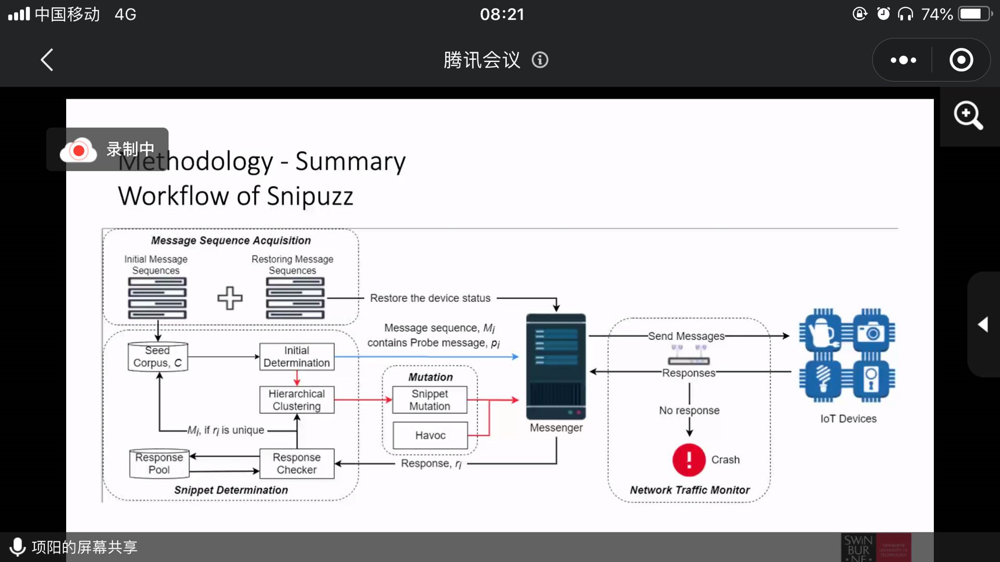

## limitation

- Manual effort
  - suitable inputs
- Encryption
  - if communication is encrypted, effectivess is not ideal
- Requirements on detailed response
  - depends on how much information can obtained from the responses of IoT devices

 ## 二、纪守义 - 智能化物联网漏洞挖掘

AI结合 漏洞挖掘

### 一些相关工作

- SmartSeed

- 基于缺陷预测的漏洞导向型模糊测试系统

  - 二进制程序逆向与数值编码-基于图嵌入网络的程序缺陷预测模型 - 漏洞导向的模糊测试（V-FUZZ: Vulnerability Pridiction-Assisted Evolutionary Fuzzing for binary Programs   IEEETransanction of Cybernetics）
  - 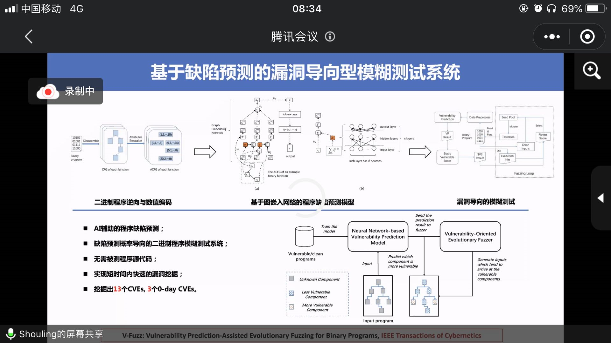

  

- MOPT

  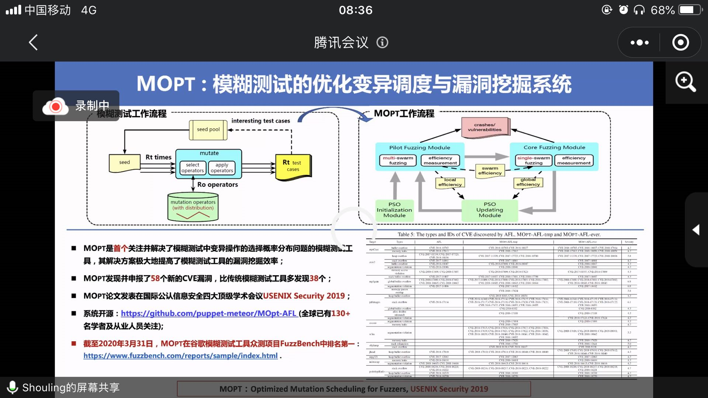

- 固件内核漏洞检测

  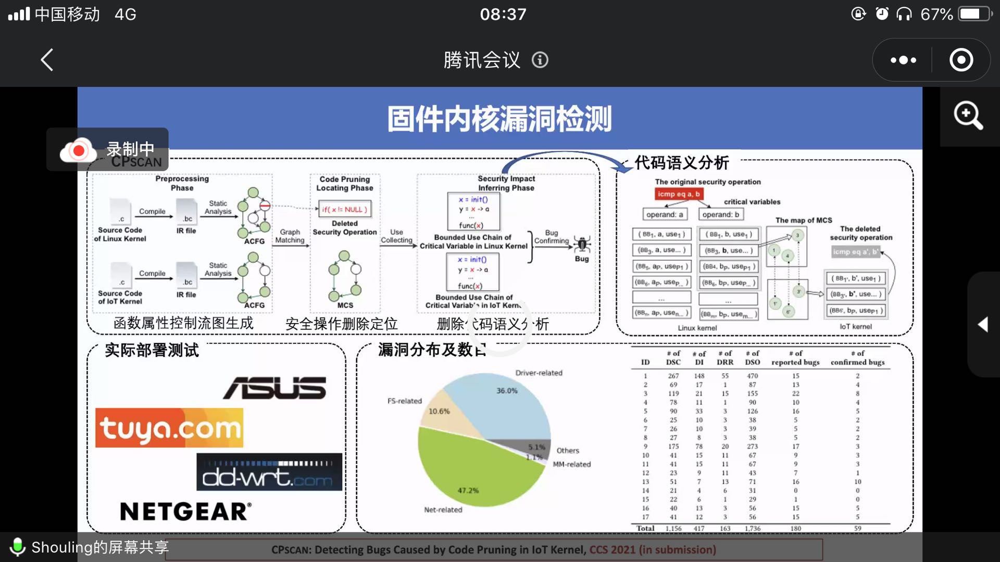

- 物联网二进制固件漏洞挖掘系统

  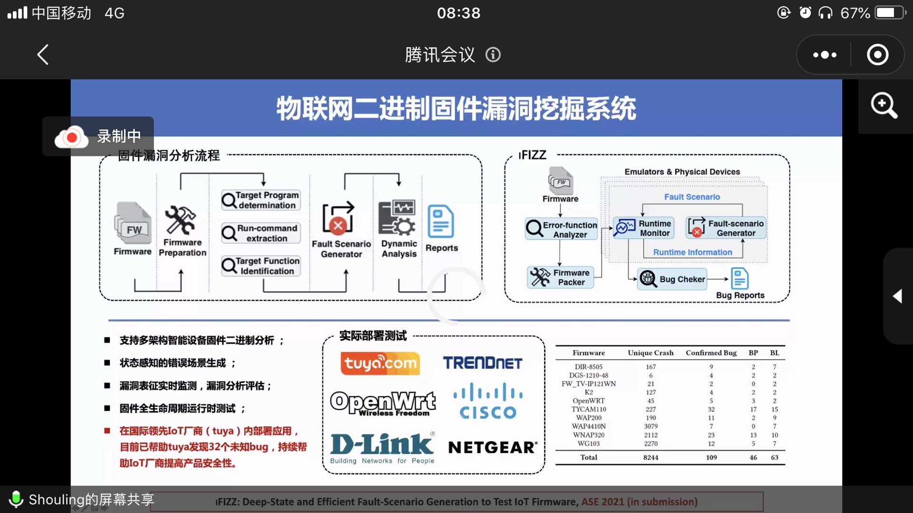

- FirmSec: 物联网固件漏洞分析系统

  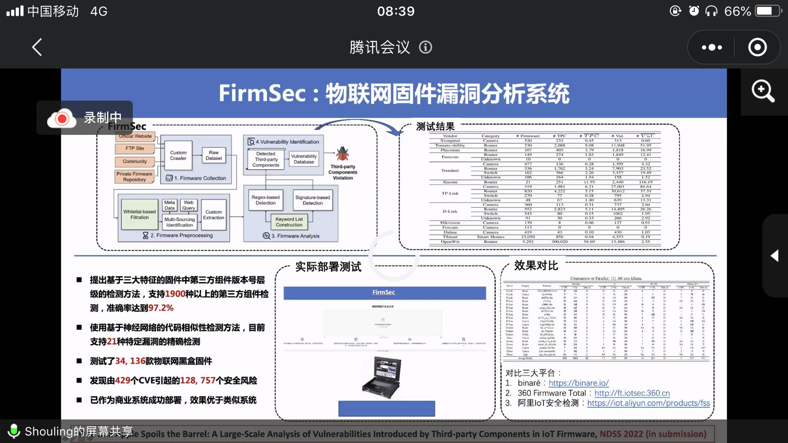

- 代码路径分析与漏洞挖掘系统

  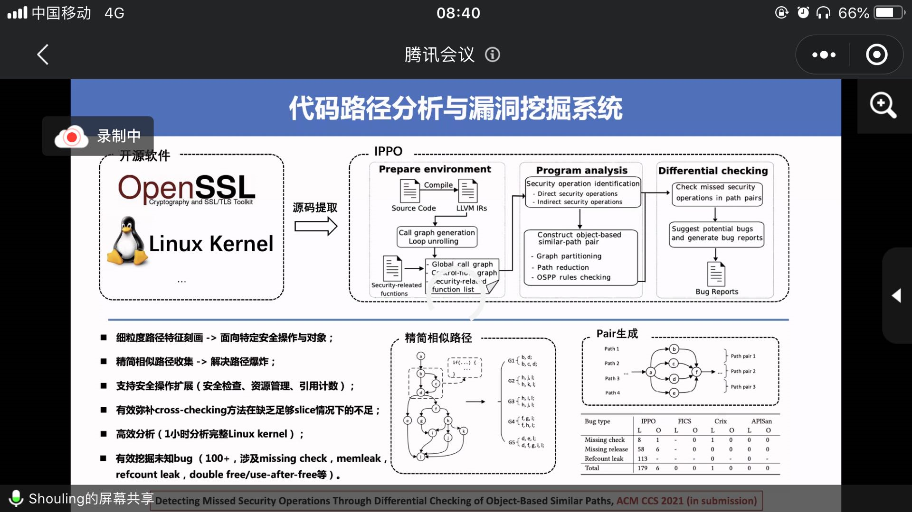

- “清道夫”：高危0 day 云虚拟化系统逃逸攻击

  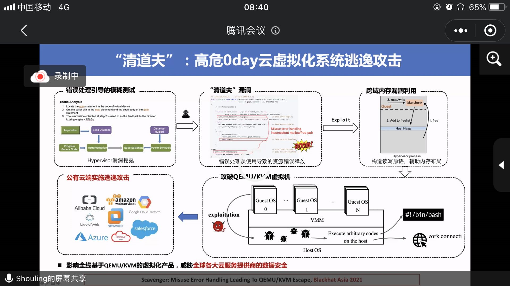

- V-shuttle： 云虚拟化系统漏洞挖掘平台

  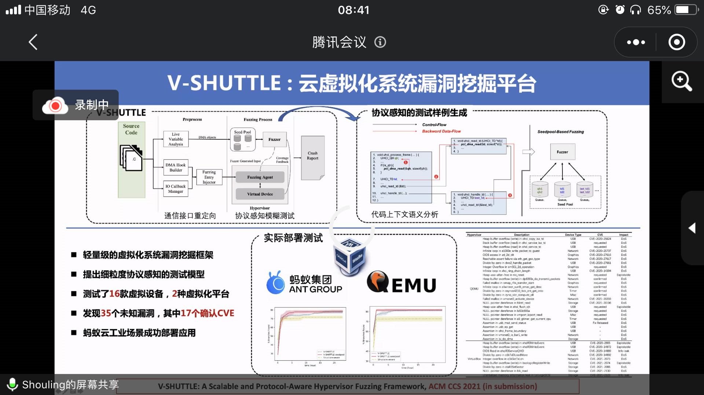

- 模糊测试工具系统性测试、评估与分析

  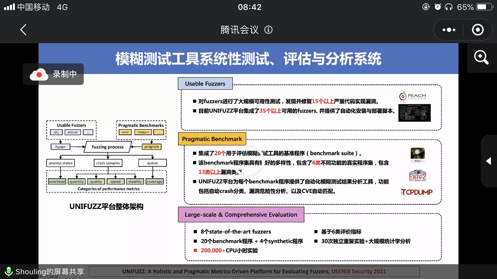

- MPInspector: A systematic and automatic approach foe evaluating the security of IoT Messaging Protocal 

- 通信协议分析

  - MQTT/ COAP/ AMQP
  - 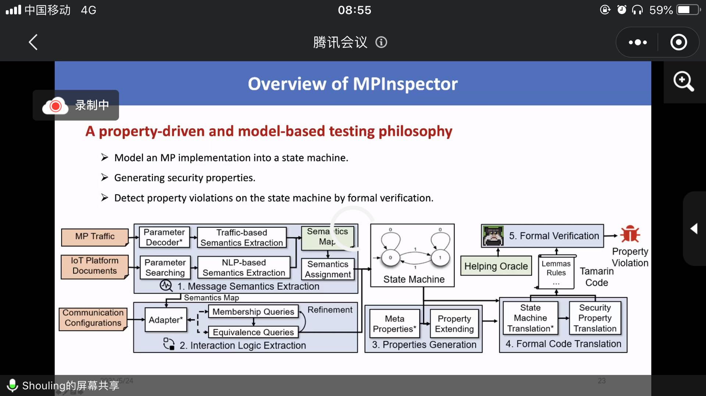

  **NLP？？？**

## 三、张超- 知识驱动-物联网漏洞挖掘

深度 / 广度

启发式，知识驱动嘛， 数据驱动

GreyOne, FANS,

> Tips:
>
> 用AFL打超级玛丽游戏通关

# Q&A：

协议：

状态机，保留到达某个状态的输入，认证权限

如何快速跳转

不知道协议是怎么实现的，推倒测试，构建状态机

有向带权

direct fuzzing

指定消息序列100，10个固定的，能到某个状态，然后递加

now：fuzzing，机器学习，fuzz找漏洞

数据驱动，mopt，复现研究时，发现效果很有限，怎么看

确实不是很好，但认为他有用，一个是发的早可能不够深入，另一个是

漏洞成因非常复杂，其实AI很难学出来

parameter对应的字段，公开的介绍文档，

怎么找，带关键字的句子识别出来，分三类，password is xx

解释，

工具开源否

静态分析，FANS是开源的，工具不开源

GreyONE，CALLAFL-否公开，，FANS-公开