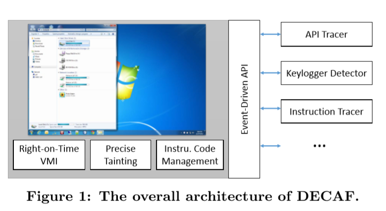

# DECAF

## 1. Introduction

基于QEMU的，针对动态分析框架，提供实时虚拟机自省功能

结合TCG指令级的污点分析

提供插件-事件驱动程序接口（*3类插件：指令tracer、keylogger detector、API  tracer*）

实现方面，包含**9550行C++/10270行 C**代码

- 通过监测硬件层事件-重构 系统级别 语义信息
- 基于事件的接口，注册（内核空间、进程、内核模块）

### 三个sample plugins

- API Tracer 通过hook API entries and exits, 追踪API调用

- Keylogger

- Instruction tracer: within specific context（user-level process or a kernel module）记录指令执行

支持多种架构

### 解决了4个问题：

1. 如何重构OS-level semantic view

   VMI / TEMU

4. multiple taint labels？

   precision taint information / bit level 

## 2. System overview

**描述架构图：**

> decaf 一个增强版qemu，（QEMU通过动态二进制翻译技术仿真不同目标架构）
>
> 如图所示，可以在虚拟机内部运行一些感兴趣的程序，同时在外部通过分析插件进行分析。为提供不同分析能力，DECAF参与动态二进制翻译过程（如何参与的第三部分介绍）

### 功能点（组件components）

1. #### Just-in-Time VMI

   

2. #### Precise and lossless tainting (精确低损耗的动态污点分析)

   污点传播是异步的 两个原因：1.开销大 2. 没必要实时

   

3. #### Event-driven programming interface 事件驱动程序接口？？

   [不同于别的，DECAF是把插件？ 封装好的，不可见的，在translation phase 插桩，在execution phase分析]()

   [分析插件只需注册特定事件，implement the corresponding event handling functions???]()

   

4. #### Instrument management 动态插桩管理？？

   插件注册和解耦

   为节省开销，插桩代码仅在必需要的地方插入

   举例子：

   注册啥？？？？，hook的插桩代码只放一次，放在入口点

   解注册，插桩代码会被移除出translation代码

   管理插件模块，被DECAF框架管理，对插件不可见

### Sample Plugins 样例插件

keylogger-键盘记录器

有段代码实现

- 先 init_plugin(), 返回一个指针 plugin_interface_t, 会 

- 创建一个新的终端命令 taint_sendkey + plugin cleanup函数

- 该插件注册两个回调函数，my_read_tainted_mem (tainted memory read =负责检查内存哪里调用了污染key )  /  my_send_keystroke (sending keystroke)

  

使用流程

在终端输入 taint-sendkey 终端命令，注册的回调函数my_send_keystroke被调用，相应的keystroke 被污染，然后从 keyboard device 开始传播，通过OS内核，到目标的用户层程序（user-level program）

DECAF 实现全系统动态污点分析，可观察到整个污染传播flow

当一个指令读取tainted memory location，框架调用注册的回调函数my_read_tainted_mem，该回调函数检查该指令所在的代码模块，记录有关此次污染的相关信息，以便进行脱机分析

what / why / how

调度方法 :一个 只插入一个 回调函数

---

plugin - interface - qemu

1. plugin

   init（） - loadmodule -  vmicallback - cleanup

2. interface

   callbacks

   VMI

   instruction - Block

   ​					DECAF-insn

   mem - read / write

   keystroke

   eip

   

   callback函数 注册和注销

   

参考链接：

https://code.google.com/archive/p/decaf-platform/wikis/decaf_interfaces.wiki