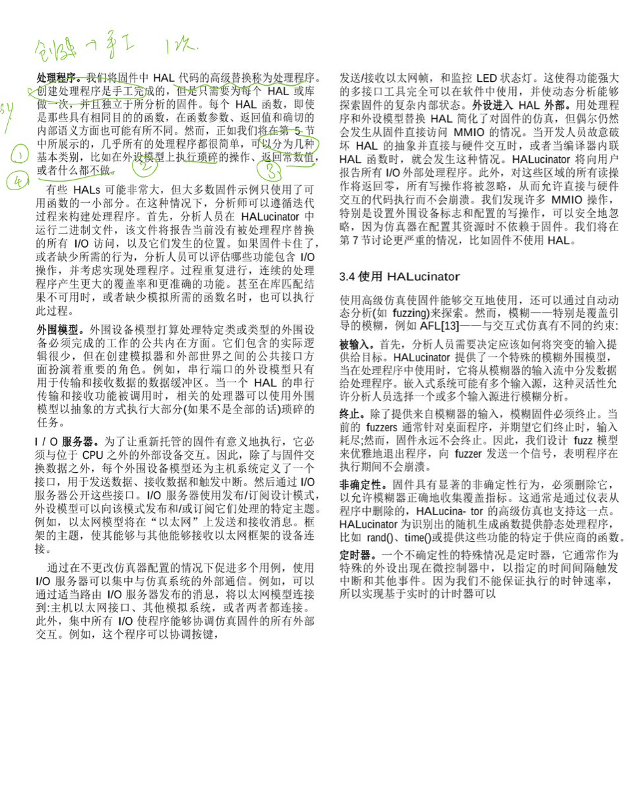
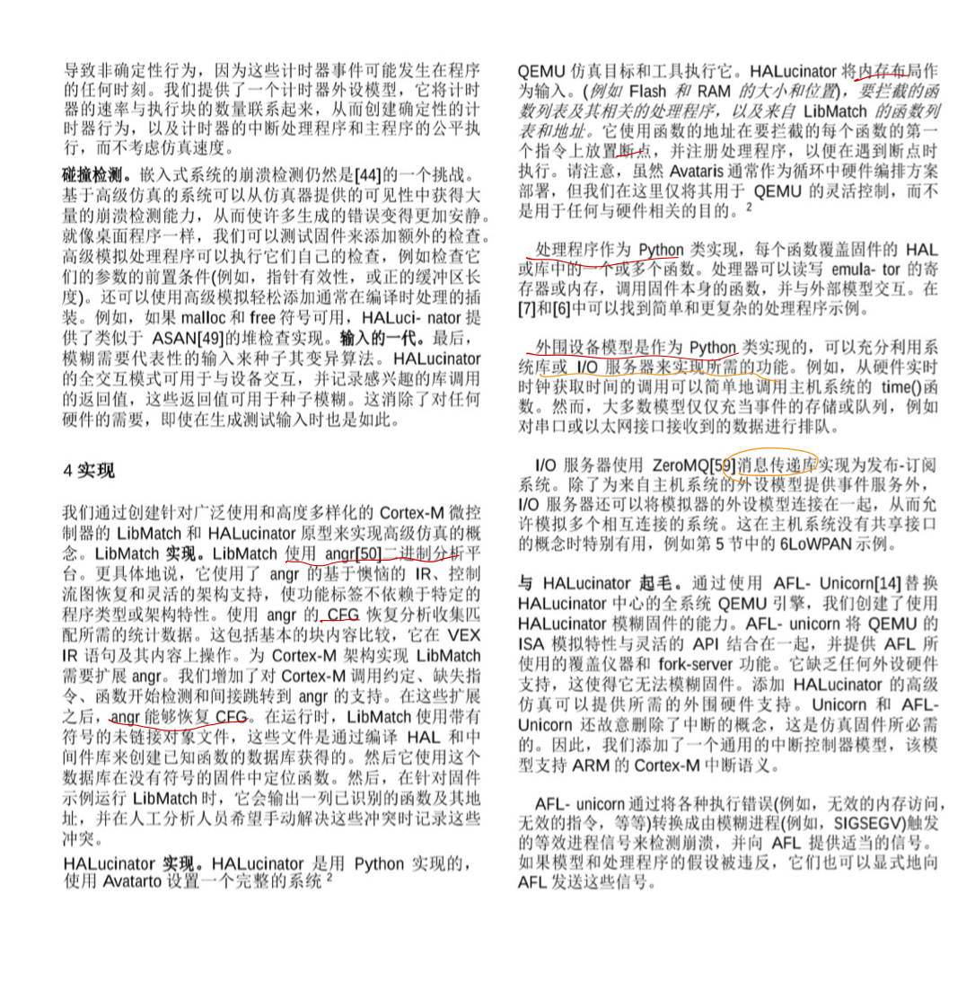

# HALucinator

HAL 硬件抽象层

 硬件抽象层 是位于操作系统 [内核](https://baike.baidu.com/item/内核/108410)与[硬件](https://baike.baidu.com/item/硬件/479446)电路之间的接口层，其目的在于将硬件抽象化。它隐藏了特定平台的[硬件接口](https://baike.baidu.com/item/硬件接口/444711)细节,为操作系统提供虚拟硬件平台,使其具有硬件无关性,可在多种平台上进行移植。 从软硬件测试的角度来看，软硬件的测试工作都可分别基于硬件抽象层来完成，使得软硬件测试工作的并行进行成为可能。 

 对于操作系统和应用软件而言，HAL是对底层架构的抽象。综合分析HAL层的代码，可以发现这些代码与底层硬件设备是紧密相关的。因此，可以将硬件抽象层定义为所有依赖于底层硬件的软件。 

 为了适应多种硬件平台，将操作系统划分出来一个可以直接和硬件通讯的层次，然后为其上层提供抽象支持，下层通过API的形式向上层提供服务。这样上层在进行硬件操作时，不需要了解设备的具体细节，从而大大减少系统理解和开发的复杂度。 

嵌入式系统是一类特殊的计算机系统。它自底向上包括3个主要部分:硬件环境、嵌入式操作系统和嵌入式应用程序。硬件环境是整个嵌入式操作系统和应用程序运行的硬件平台，不同的应用通常有不同的硬件环境;因此如何有效地使嵌入式操作应用于各种不同的应用环境，是嵌入式操作系统发展中所必须解决的关键问题。硬件抽象层通过硬件抽象层接口向操作系统以及应用程序提供对硬件进行抽象后的服务。当操作系统或应用程序使用硬件抽象层API进行设计时，只要硬件抽象层API能够在下层硬件平台上实现，那么操作系统和应用程序的代码就可以移植。这样，原先嵌入式系统的3层结构逐步演化为一种4层结构。图

显示了引入硬件抽象层后的嵌入式系统的结构 [3] 。

稿子：

°位于操作系统内核和电路之间的接口层，其目的在于将硬件抽象化。

°隐藏了特定平台的硬件接口细节，为操作系统提供虚拟硬件平台，使其具有硬件无关性，可在多种平台上进行移植。 

HAL层的根本设计目的是在于上层软件可以通过常规的通用接口访问MCU的某些资源，而不用去关心“是哪个MCU”在做的，模糊了最底层的函数实现。

°     为了减轻开发固件的一些挑战  ，     芯片供应商和各种第三方提供了硬件抽象层（HALs），  向程序员提供高级硬件操作的软件库，同时隐藏固件执行的特定芯片或系统的细节，这使得在给定供应商的许多相似模型之间，甚至在不同芯片供应商之间移植代码变得更加简单。因此，通过设计，用HALs编写的固件与硬件之间的耦合较少。

---

高级仿真HLE (High-level Emulation)

(由于，硬件抽象层可以使得固件与硬件解耦，收到这个的启发，决定提出高级仿真这一技术

即刚才说的，对HAL进行替换  **仿真即替换，由他来代替真实硬件，模拟与真实硬件的交互过程**

°通过使用高级抽象层+可重用替换功能来支持嵌入式系统的可伸缩仿真

 	°步骤

​	±识别在固件映像中负责硬件交互的HAL函数

±	提供简单的，由分析人员手工创建的高级替换，从固件角度执行相同的概念性任务

---

其中，第一个识别部分，我们知道为了简化开发，HAL是开源的，并打包了一个特定的编译器工具链，所以利用源代码，可以简化识别这项任务

第二个替换，每个替换功能（称为处理程序）都是手工创建的 ，但可以达到使用很小的工作量，覆盖同一供应商的芯片甚至使用同一中间件库的固件)

处理程序

±处理程序

°	即 替换操作，手工创建，处理程序可以使用外设

°	具体实现很简单， 且只需要拦截相应的HALs函数，将所需要的参数传递给适当的外围设备模型，并返回固件期望的值    

可以执行像通过直接内存访问（DMA）外设发送以太网帧这样复杂的任务  ，也可能只是传递一个HAL函数需要的参数到外设模型。，在许多情况下根本不用执行任何操作（因为有些硬件在仿真中不存在，比如电源，时钟）

---

挑战

±硬件和外设

°重新托管过程中，需要解决的两个问题一个是硬件，=需要模拟仿真固件运行的环境

°外设 = 其次是固件与芯片外设的交互 

±说明性案例

温度的例子，讲一下流程，+说明 现在 固件中的功能都构建在中间件库 和HALs 上， 这些不同的库函数对应抽象了不同的底层功能，将应用程序与物理硬件解耦

   	各种库的创建是为了抽象 直接的硬件交互

​		了解 如何使用这些HALs构建固件是本系统如何模拟固件的基础

​		如图，芯片上的外设和芯片外的硬件并不存在，但系统的大部分功能依赖于与这些组件交互（实验发现访问不存在外设时停止）

°为了打破固件和硬件的耦合，必须选择一个层（中间件库或HAL ）拦截 ，并插入其替代功能

​		但选择哪一层，（影响分析）HAL：最多数量的函数，+具体的语义+与硬件特性有复杂交互

​		高级一点的网络栈或中间件，无法预测用了哪些库，但围绕这些层构建的处理程序简单，且便于移植

​		仿真手动的工作量取决于插入函数的调用级别，

---

架构

±在qemu上提供一个高级仿真环境

±支持固件（所有代码都静态链接到一个可执行二进制文件）

±可以处理复杂的外设（以太网，Wifi，IEEE.802.15.4）

±能够模拟固件和其与外部世界的交互（本文充分模拟 混合仿真环境，无线网络，支持应用程序的设备，从而允许交互式仿真，使设备在不使用硬件的情况下实现原始功能）

±结合AFL，展示本系统对安全分析的适用性，同样也是不适用任何原始硬件的情况下，可以发现安全漏洞

（讲讲图

---

设计与实现-ppt

±采用模块化设计

±1）通过库匹配，在固件中定位 HAL 库函数

±2）提供 HAL函数 的高级替换

±3）允许与仿真固件进行外部交互

---

±库匹配

°所谓替换的最关键一步是先定位抽象在程序中的位置

开源的人之间能够获得这些信息，但对于第三方分析闭源的二进制固件，就需要在仿真之前定位这些库函数

±固件本身特性使得库匹配更加复杂，因为可能对大小做过优化

±固件库函数的一个特点是：在代码的非库部分调用函数，在HALs中常见的模式是重写和显式回调，因此为了提供完成工作的处理程序，需要恢复库函数的名称和地址，还要恢复他们调用的应用程序代码和地址

和普通的桌面库函数不同，桌面的是被调用，执行功能，然后返回给调用函数，但固件库函数 会涉及重写符号或显示回调。所以不能只关心库函数的名字和地址，还要找到他们调用的应用代码名称和地址

±为了解决上述问题，创建Libmatch库匹配技术，（利用程序中函数的上下文来帮助进行二进制到库的匹配）

°提取库的未链接的二进制对象文件的控制流图 + 代码的中间表示（IR）

°创建一个用于匹配的HAL函数数据库，然后执行以下步骤，依次细化可能的匹配：

统计比较

​	对目标程序中的每对函数和数据库中的库函数，比较三个基本指标：基本块数量，CFG边，函数调用， ，如果这三个有不一样的地方，就不阔能使匹配的，会移除这些不匹配的，可以显著提高性能

基本块比较

​	上一步匹配的函数对，进一步比较基本块的内容， 如果两个函数的基本块中间表示（IR）内容 完全匹配，认为两个匹配，

​	这里会丢弃一些已知的指针和偏移，还有无法解析的跳转和调用，

​	当直接匹配用于通过上下文派生其他匹配的时候，可能具有级联效果，即使在于精确的编译器和库版本匹配的理想场景中，也会发生冲突？

上下文匹配

​	上一步会产生一系列（一组）的匹配和碰撞（有一些函数不能和其他的区分开），因此会借助目标程序的函数的上下文，  来消除这些情况的歧义？ 通过判断程序中匹配的位置来猜测其他函数可能是什么，

虽然有一些工具会使用两个程序的调用图来进行匹配，但本文，第二个等待匹配的是数据库中的库函数，没有链接也没有调用图

​	使用 调用者 和被调用这 caller callee 上下文来有效的近似真实库函数的调用图

​	首先利用调用者 上下文，对于每个可能的碰撞匹配？ 使用库的调试信息来提取调用的函数名集，

​	对于被调用的，收集在第二步中能够精确匹配的任何函数调用的函数集，并在库对象的调试符号中为他们命名

最终匹配使用函数上下文（调用者和被调用者）来消除二进制等价函数的歧义，这对于H系统正确拦截和替换函数是必须的

---

高级仿真

±在函数识别之后，仿真器必须替换所选函数的执行，以确保重新托管的固件正确执行。

±这些拦截功能与设备的片内或片外外设有关，并且是手动实现的。为了简化实现，将每个库所需的实现，分解为：处理程序和 外设模型

​     在这种情况下，每个外设模型只需要编写一次，只需要一个小型的专门处理程序来处理每个匹配的HAL函数  

ppt

---

fuzzing

---

---

实验评估

2

使用QEMU、Avatar、HALucinator交互式的对表1中的16个固件进行重新托管，

QEMU/Avatar/HALucinator 最终，在模拟系统上可达到成功通信，或与在真实硬件上执行相同的功能。

本表，显示了每个固件使用的软件库，以及HALucinator建模的外部接口，BB：不同技术，执行的唯一基本块的数量 ，即有多少个固件被执行，EBC ：外部输入和输出行为是否与在物理硬件上执行固件观察到的相匹配，即执行正确与否

Avator Fwd:表示转发内存请求的数量， 

HAL：func:拦截函数的数量，表示使用HAL模拟固件需要多少工作，和 默认MMIO处理唯一地址的数量，即访问硬件，可能会被进一步拦截HAL函数替代

本实验展示了HAL系统如何对固件进行仿真，并达到和固件执行在真实硬件上 相同的外部功能，这个是别的方法所没有的。在示例固件上平均执行1000多个基本块，比A多10倍，来自三个不同制造商的四种不同板的仿真演示了HLE的硬件兼容性，并对所有板的相同外设模型的重用显示在供应商和硬件平台之间的可伸缩性

3 fuzzing

本实验显示 HALucinator能够实现对固件的实际安全分析，而且无需大规模的重新设计工作，也无需任何硬件，**可伸缩性包括可模拟的固件类型，和可并发模拟的实例数量，**使得大规模并行模糊测试成为可能。根据发现的bug也表明仿真对于复杂固件的动态分析是有用的。