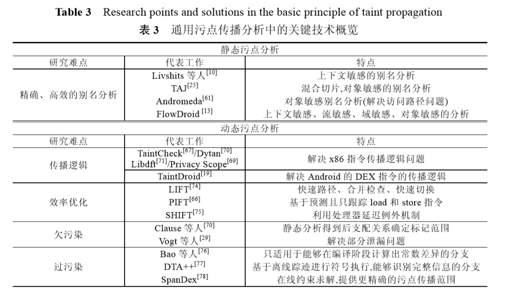
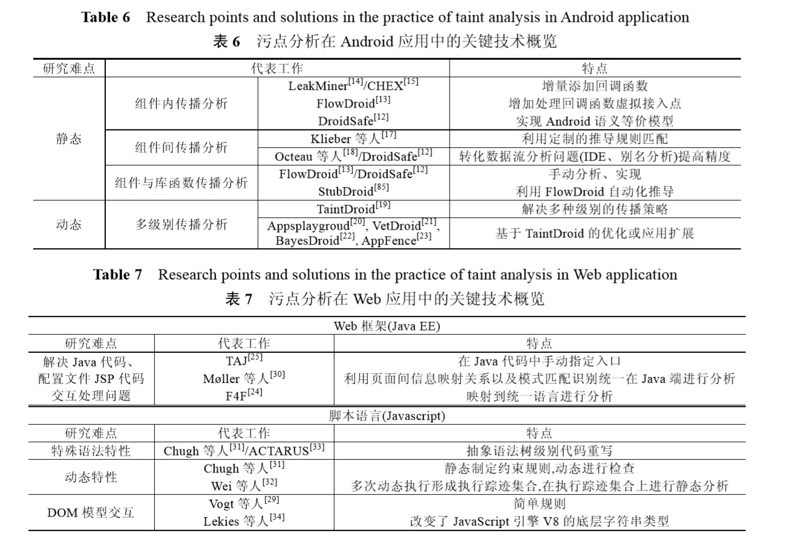

 ## 污点分析

#### 概述

污点分析可以抽象成一个三元组〈sources,sinks,sanitizers〉的形式,

- source 即污点源,代表直接引入不受 信任的数据或者机密数据到系统中;

- sink即污点汇聚点,代表直接产生安全敏感操作(违反数据完整性)或者泄露 隐私数据到外界(违反数据保密性);

- sanitizer 即无害处理,代表通过数据加密或者移除危害操作等手段使数据传 播不再对软件系统的信息安全产生危害.

  污点分析就是分析程序中由污点源引入的数据是否能够不经无害处 理,而直接传播到污点汇聚点.如果不能,说明系统是信息流安全的;否则,说明系统产生了隐私数据泄露或危险 数据操作等安全问题.

#### 一. 识别污点源

现有的识别污点源和汇聚点的方法可以大致分成 3 类:

- 一类使用启发式的策略进行标记,例如把来自程序 外部输入的数据统称为“污点”数据,保守地认为这些数据有可能包含恶意的攻击数据
- 工具会根据具体应用程序调用的 API 或者重要的数据类型,手工标记源和汇聚点(如 DroidSafe[12]);
- 第 3 类工 具使用统计或机器学习技术自动地识别和标记污点源及汇聚点 

#### 二. 污点传播分析 

污点传播分析就是分析污点标记数据在程序中的传播途径.

按照分析过程中关注的程序依赖关系的不同, 可以将污点传播分析分为显式流分析和隐式流分析. 

- 显式流分析:就是分析污点标记如何随程序中变量之间的数据依赖关系传播.

- 隐式流分析:是分析污点标记如何随程序中变量之间的控制依赖关系传播,也就是分析 污点标记如何从条件指令传播到其所控制的语句.

  (对隐式流污点传播处理不当导致本 应被标记的变量没有被标记的问题称为**欠污染(under-taint)**问题.相反地,由于污点标记的数量过多而导致污点 变量大量扩散的问题称为**过污染(over-taint)问题**.目前,针对隐式流问题的研究重点是尽量减少欠污染和过污 染的情况.)

#### 三.  无害处理 

无害处理模块：是指污点数据经过该模块的处理后,数据本身不再携带敏感信息 / 针对该数据的操作不会再对系统产生危害.换言之,带污点标记的数据在经过无 害处理模块后,污点标记可以被移除.

正确地使用无害处理可以降低系统中污点标记的数量,提高污点分析的效 率,并且避免由于污点扩散导致的分析结果不精确的问题. 

无害处理：包括 加密函数 / 输入验证模块 等

#### 四. 关键技术

动/静态分析 分析 显/ 隐式流

1. 显式流分析

   静态分析：

   转换成分析程序间的数据依赖关系 看 能否从 污染源 传播到 sink点（污点汇聚点）

   - 首先,根据程序中的函数调用 关系构建调用图(call graph,简称CG);
   - 然后,在函数内或者函数间根据不同的程序特性进行具体的数据流传播分 析.
   - 常见的显式流污点传播方式：直接赋值传播、通过函数(过程)调用传播以及通过别名(指针)传播

   分析过程会有很大时空开销，由于只关心入口和出口之间的程序片段，可以尝试采用按需(on-demand)定制的别名分析方法

2. 动态分析技术 

   动态污点传播分析(简称动态污点分析)是指在程序运行过程中,通过**实时监控**程序的污点数据在系统程序 中的传播来检测数据能否从污点源传播到污点汇聚点.

   动态污点传播分析首先需要为污点数据扩展一个**污点标记(tainted tag)的标签**并将其存储在存储单元(内存、寄存器、缓存等)中,然后根据指令类型和指令操作数设 计相应的传播逻辑传播污点标记.

   动态污点传播分析按照实现层次被分为基于硬件、基于软件以及混合型的污 点传播分析这 3 类.

   - 基于硬件

     需要定制的硬件支持,一般需要在原有体系结构上为寄存器或者 内存扩展一个标记位,用来存储污点标记,代表的系统有Minos[62],Raksha[63]等.

   - 基于软件

     基于软件的污点传播分析通过修 改程序的二进制代码来进行污点标记位的存储与传播,代表的系统有 TaintEraser[64],TaintDroid[19]等.

     基于软件 的污点传播的优点在于不必更改处理器等底层的硬件,并且可以支持更高的语义逻辑的安全策略(利用其更贴 近源程序层次的特点),但缺点是使用插桩(instrumentation)或代码重写(code rewriting)修改程序往往会给分析 系统带来巨大的开销.

   - 混合型污点传播分析

   

- 基于虚拟环境的污点分析 

  基于虚拟环境的污点分析的核心思想是在虚拟环境中增 加污点分析模块，使污点分析模块和被分析的目标程序运行 在不同环境中。其中，分析模块运行于虚拟机监控层，目标程序处于目标机操作系统层，分析模块不影响目标程序的运行， 记录的污点信息更准确，

  动态分析平台 TEMU 在 QEMU 虚拟机的基础上进行了扩展，能够以较细的粒度分析内核与 多进程间的交互情况

  基于虚拟环境的污点分析不需要修改程序的代码，由于 虚拟机监控层的权限比目标机操作系统层更高，因此分析模 块能够记录系统调用甚至内核执行的指令信息，可以发现系 统底层漏洞，

- 基于代码的污点分析 

  基于代码的污点分析根据分析对象的不同也可以被细分 为对**程序源码**进行污点分析和对**二进制代码**进行污点分析两 种。

  - 基于代码的污点分析工具基本都采用了程序切片技术， 使其对程序的理解和分析更为精确。

    程序切片是指能够影响 程序某行的某个变量值的部分语句和判定表达式的集合。自 1979 年被提出后，程序切片技术已经发展出静态切片与动态 切片、前向切片与后向切片以及一些变种技术等多种方法。对程序源码进行污点分析是实现一个带有安全标签的类 型系统，在编译过程中读取程序源码的安全标签，以检查是否 存在违反信息流策略的情况。

    对程序源码进行污点分析能够在 程序编译时发现程序中违反信息流策略的情况，对系统资源 的开销较小，分析执行效率高，缺点是需要获得源代码，在商 业环境下应用难度较高。 

  - 对二进制代码进行污点分析是在二进制代码中插入污点 跟踪代码，以获取程序执行时的污点传播情况。动态污点分 析常采用这种方式。

    对二进制代码进行污点分析可以在指令 级别进行污点跟踪检测，精确度高，但频繁的插桩会占用系统 资源，降低系统运行效率。此外，计算机的指令类型和规模使 得二进制代码的精确建模极为困难，且二进制代码缺乏高层 语义支持，一般需要依靠插桩平台或二进制反汇编工具以降 低工作量。

5. 应用案例

   1）安卓隐私泄露检测

   2）Java Web 框架上的污点分析技术 

   服务器和web 交互

#### 总结

 最后,除了解决应用程序中的安全问题这一传统职责外,污点分析技术也逐渐被应用在程序分析领域其 他问题(如性能分析、软件缺陷定位、错误检测等)的研究和实践中.RETracer[98]提出了一种针对二进制代码的 动态后向污点分析技术来定位引起软件系统崩溃的浅层原因.ConfAid[99]基于通用污点分析技术提出了一种专 门用于解决由于配置文件中的错误而导致性能下降的错误定位技术.X-ray[100]在 ConfAid 的基础上,利用污点 分析技术逆向追溯导致性能瓶颈的根本原因.如何将污点分析技术与程序分析领域的其他技术相结合、扩展污 点分析技术的应用范畴,也是一个值得探索的研究方

与符号执行结合使用 

符号执行( Symbolic Execution，SE) 的核心思想是使用符 号值替代具体数据作为程序输入，并在程序执行过程中以符号 值进行计算，用包含符号的表达式表示程序变量的值和最终的 输出结果。将污点分析与符号执行结合使用的分析工具有 **Angr 和 DsVD**等。符号执行的精度比污点分析技术高， 

陈力波等［36］提出了基于类型的动态污点分析技 术，其核心思想是将类型信息和符号值作为污点信息，在程序 执行时同时进行动态污点分析和符号执行，程序运行结束后 获得污点传播信息和程序执行路径条件，最后通过求解得到 输入变量满足的约束条件。这种技术结合了动态污点分析和 符号执行的优点，对程序有较为全面的理解。朱正欣等［37］基 于动态插桩平台 Pin 以及 libdft 提出了动态符号化污点分析 方法，其核心思想是将污点信息及污点检查策略符号化，并分 析污点数据在传播过程中是否违反污点检查策略，进而判断 程序在动态执行过程中是否存在非法数据操作。还有 BitBlaze ［38］将动态分析与静态分析、混合符号执行与具体执 行、系统仿真与二进制重写等多种分析方法相结合，对二进制 代码进行分析。 

#### 参考文献：

污点分析技术的原理和实践应用-计算机学报-2016

[98]   Cui W, Peinado M, Cha SK, Fratantonio Y, Kemerlis VP. RETracer: Triaging crashes by reverse execution from partial memory dumps. In: Proc. of the 38th Int’l Conf. on Software Engineering. ACM Press, 2016. 820−831. [doi: 10.1145/2884781.2884844]

[99]   Attariyan M, Flinn J. Automating configuration troubleshooting with dynamic information flow analysis. In: Proc. of the Usenix Conf. on Operating Systems Design and Implementation. USENIX Association, 2010. 1−11. https://www.usenix.org/conference/ osdi10/automating-configuration-troubleshooting-dynamic-information-flow-analysis 

[100]   Attariyan M, Chow M, Flinn J. X-Ray: Automating root-cause diagnosis of performance anomalies in production software. In: Proc. of the Presented as Part of the 10th USENIX Symp. on Operating Systems Design and Implementation (OSDI 2012). 2012. 307−320. https://www.usenix.org/node/170861 

Angr：

［34］ SHOSHITAISHVILI Y， WANG Ｒ， SALLS C， et al． SOK: ( state of) the art of war: offensive techniques in binary analysis ［C］/ / Proceeddings of the 2016 IEEE Symposium on Security and Privacy． Washington， DC: IEEE Computer Society， 2016: 138 －157． 

DsVD:

［35］ WANG Z， TANG Z， ZHOU K， et al． DsVD: an effective low-overhead dynamic software vulnerability discoverer ［C］/ / Proceedings of the 10th International Symposium on Autonomous Decentralized Systems． Washington， DC: IEEE Computer Society， 2011: 372 －377． 

［36］ 诸葛建伟，陈力波，田繁，等． 基于类型的动态污点分析技术研 究［J］． 清华大学学报( 自然科学版) ，2012，52( 10) : 1320 － 1334． ( ZHUGE J W， CHEN L B， TIAN F， et al． Ｒesearch of technology for type-based dynamic taint analysis ［J］． Journal of Tsinghua University ( Science and Technology) ， 2012， 52 ( 10) : 1320 －1334． ) 

## 污点分析-其他一些相关工作

###  [Kirenenko](https://github.com/ChengyuSong/Kirenenko) 

由于许多污点引导的模糊测试器（包括 Angora 和 RedQueen 

 由于实现非常简单（对 LLVM 中的数据流清理器进行了小小的修改），所以我认为不值得为此撰写论文。因此，我只是对源代码进行了开源，希望人们能基于它构建更多有趣的工具。 

### 一篇硕士毕业论文-符号执行+污点分析

考虑了一种情况是，一个数组，int a[5]；为每一位元素分配一个符号，当出现数组内部异或运算之类的变换时，可使用符号执行

实验方面，自己写一个带漏洞的函数，例如简单的strcpy( buf, str,len),以造成缓冲区或堆栈溢出，观察内存，看是否覆盖返回地址

设置了污点分析的标注及规则， 