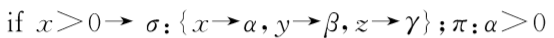
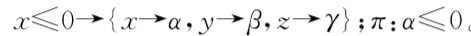
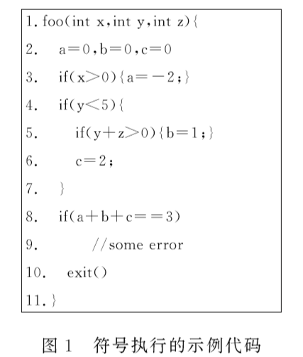
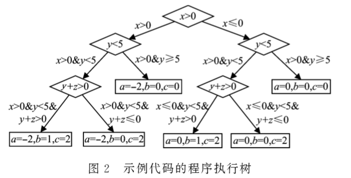

## 符号执行技术小结

### 一、符号执行概述

符号执行是一种程序分析方法，常用于软件测试和程序漏洞与脆弱性验证的检测中。

#### 定义：

1. 在程序运行过程中，采用 抽象符号值 代替 程序变量具体值 作为输入，将 程序输出 表示为 输入符号值相关的函数表达式；
2. 根据程序语义，在执行过程中，遍历程序的执行空间，遇到分支指令时，搜索程序的每个分支，并将分支条件加入符号执行保存的程序状态 π 中；
3. 然后通过约束求解的方式，验证节点的约束可解性和路径是否可达，可解即可达，此时得到的解就是一个可以触发目标代码的具体值。若不可达，则结束对该路径的分析。

#### 目标：

尽可能多的探索不同的程序路径(program path)。对于每一条程序路径，(1) 生成一个具体输入的集合；(2) 检查是否存在各种错误，包括断言违规、未捕获异常、安全漏洞和内存损坏 

#### 一些基本概念：

- pc: 下一条执行语句（赋值语句、条件语句、跳转语句）
- π ： 当前路径约束条件，表示执行到程序特定语句需要经过的条件分支，以及各分支处关于符号值的表达式，初始定义为true
-  σ ：与程序变量相关的符号值集合，包括具体值和符号值表达式

e.g.

 

#### 一个例子：

程序执行树：

#### 一些名词：

**执行路径(execution path)**：一个true和false的序列seq={p0,p1,...,pn}。其中，如果是一个条件语句，那么pi=ture则表示这条条件语句取true，否则取false。

**执行树 (execution tree)**：一个程序的所有执行路径则可表征成一棵执行树。

**符号状态 (symbolic state)**：符号执行维护一个符号状态e，它将变量映射到符号表达式。

**符号路径约束 (symbolic path constraint)**：符号路径约束PC，它是符号表达式上无量词的一阶公式。

### 二、符号执行分类

根据符号执行发展状况，可以将其分为经典符号执行、动态符号执行、选择性符号执行。

#### 1. 经典符号执行

不真实执行，基于解析程序，通过符号值模拟执行

#### 2. 动态符号执行

**动态符号执行** = **具体执行** concrete execution  **+** **符号执行** symbolic execution（二者结合），又分为混合执行 和 执行生成测试

- **混合执行（ Concolic execution）**

  需要一个随机的具体值作为初始输入，维护一个concrete state + symobolic state

  定义：

  	1. 使用具体的输入执行程序，通过程序插桩的方式，收集路径约束条件，按顺序搜索程序路径，利用约束求解器求解上一次执行收集到的路径约束，从而得到下一次执行的测试用例
   	2. 在下一次执行结束后，根据一定的策略，选择路径约束中的某一分支判断点进行**约束求反**，得到新的约束路径
   	3. 再用约束求解器求解，得到下一次执行的测试用例
   	4. 使用新的测试用例，继续探索新的路径，，循环往复

  

  优点：理论上可进行全覆盖，可以避免执行重复路径，以尽可能少的测试集达到高测试覆盖率的目的

  缺点：随着分支增加，程序状态空间指数级增长+ 约束求解限制

  

- **执行生成测试（ Execution-Generated Testing, EGT ）**

  和混合执行的不同点在于，具体执行和符号执行的结合方式不一样，它的混合是 在符号执行前，确定是具体值 or 符号值，对符号无关的代码段用具体执行，对符号变量相关的用符号执行

  

  *即，在执行每个操作之前，检查每个相关的值是具体的还是已经符号化了的，然后动态地混合具体执行和符号执行。如果所有的相关值都是一个实际的值（concrete），那么，直接执行原始程序（即，操作，operation）。否则（至少一个值是符号化的），这个操作将会被符号执行* 

  

  在符号输入执行程序的过程中，在分支处，将false路径状态信息记录下来，一直选择true分支继续执行

  

  定义：

   	1. 用符号变量作为输入执行程序
   	2. 遇到条件分支，记录true/false的约束条件，**选择true分支路径继续执行，同时将false路径压栈存储**，
   	3. 继续执行，每当遇到分支，就记录两个路径约束条件，并选择true执行，false存储
   	4. 一直到最终的true分支，约束求解，得到第一个测试用例
   	5. 再从栈存储中调用false路径约束条件，求解得到第二个测试用例，
   	6. 依次一级一级取出false约束，求解测试用例，直至栈空，针对所有的路径的测试用例，选择会触发的程序错误的分支，得到触发该错误的用例。

  

  优点：系统高效的得到所有路径信息及对应的测试用例，避免重复性搜索

  缺点：对内存耗费大，可以采用多线程代替分支存储，实现多分支同时搜索和测试用例生成

总体来说，因为concolic执行的出现，让传统静态符号执行遇到的很多问题能够得到解决——那些符号执行不好处理的部分、求解器无法求解的部分，用实际值替换就好了。使用实际值，可以让因外部代码交互和约束求解超时造成的不精确大大降低，但付出的代价就是，会有丢失路径的缺陷，牺牲了路径探索的完全性 。

#### 3. 选择性符号执行

​	定义：针对感兴趣的代码部分，进行符号执行，其余部分使用真实 具体值执行

​	缺点：可能会漏掉一些路径

### 三、挑战与解决方法

- #### A）路径爆炸问题

1. 启发式搜索，对程序路径空间进行探索

   传统是深度优先搜索(DFS)和广度优先搜索(BFS)，

   KLEE提出随机路径选择搜索 和 覆盖率优化搜索策略

   随机分支搜索 / 控制流导向搜索 / 

   优点：避免陷入饥饿状态，即搜索局限在小范围内

   缺点：长路径搜索时，对路径的计算和筛选 需要耗费较长时间，可能无法得到符合的路径

   

2. 冗余路径剪枝

   a) 两条路径可到达同一终点  + 到达该程序点的约束集相同，可选择一条剪枝

   b) 从每条路径的约束集中删除那些与内存相关且再也不会进行进行读取的约束

   c) 预判断，终点不可达时，对该路径剪枝 

   优点：简化路径空间，提高效率

   缺点：冗余路径判定较为复杂，可能出现误判，导致分析不到最终目标

   

3. 状态空间合并

   Veritesting 状态拟合

   优点：极大缩减程序状态空间，从而减少路径

   缺点：需满足合并但无副作用

   

4. 回归测试集确定优先执行顺序

   优点：利用现有测试集可以有导向型的在潜在目标路径上执行，较快的获得理想的覆盖路径

   缺点：现在有测试集，一组测试集仅对应一条路径 / 只测试程序一般特征，忽视了所需的特定特征

   

5. 基于约束的符号执行

   抽离出单独的函数或代码区域进行符号执行

   优点：极大提高分析针对性，避免路径爆炸

   缺点：剥离出目标函数会导致对函数分析不准确

   

- #### B）约束求解问题

  约束求解是符号执行的基础，核心问题是将路径条件的算术约束条件转换为基本的求解器问题。

  主要依赖于可满足性模理论SMT，SMT求解器核心是 布尔逻辑的可满足性理论 （SAT）

  理论上说，所有SMT问题都可以转换成SAT问题，SAT问题是历史上第一个被证明的NP-complete问题

  主流求解器有：

  微软：Z3求解器，应用领域：扩展的静态检测、测试用例生成、谓词抽象

  STP求解器，面向位向量和数组处理的约束求解器，可以应对大量数组读取、深层嵌套的数组写入、线性方程、多变量输入情况求解

  难点：

  1）非线性整数约束使得路径条件不可解

  2）路径约束条件包含外部库函数调用

1. 无关约束消除

   从当前路径约束中识别出与当前分支结果不相关的约束，并移除

   e.g.：具体化，常量表达x+1=10

2. 缓存求解

   尤其在混合执行中，希望 后续遇到的约束集 是 缓存匹配中 某约束集的子集，则可直接使用源缓存中的解作为新解，若是超集，则可借助缓存解判断是否是可行解

3. 懒约束求解

   不对每一个遇到的分支都验证路径可达性，而是在该路径到达目标位置时，才通过查询求解器，验证该路径的可达性，并求解生成测试用例

   推迟求解，仅对分析后认为可能存在潜在错误的路径求解，以避免大量不必要的求解

   缺点：程序错误可能存在程序深处，如果刚开始就判定不可达，则后续分析可能毫无意义

- C）并行处理问题
- D）内存建模： 内存建模是用一个具体的数值去近似一个固定位数的整数变量 ？
- E）执行环境仿真

### 四、优秀工具

针对有源码的：EXE、KLEE、DART 、CUTE、 jCUTE

- EXE：STP求解
- KLEE ：基于EXE，LLVM，覆盖率优化 / 随即路径选择 / 无关约束消除 + 缓存求解，高覆盖率测试集：90% ，
- DART | CUTE | jCUTE：依次基于， 针对C，java ，程序插桩 / 符号执行

针对二进制的：angr 、SAGE、BitBlaze、FuzzBall

- angr ： python + Valgrind-VEX中间语言 ，二进制符号执行 / 智能状态合并 / 各类程序流图恢复（CFG，CDG，DFG，DDG，CG）/ 反汇编 / 值集分析 / 程序切片，跨架构

- SAGE：基于DART + FUZZ，x86,

  一种新的导向型搜索策略（代搜索策略 generation search）：每次符号执行生成的新的测试用例最大化，对给定的约束路径，将该路径的条件逐一取反，并将其与约束路径的前缀信息一起提交给z3，从而得到数量巨大的新的测试用例，提高了测试用例生成效率

- BitBlaze、FuzzBall： 2010，Vine + TEMU + Rudder 

  - Vine:静态分析，提供中间表示
  - TEMU：动态分析，二进制适配的系统仿真，插桩， 污点分析
  - Rudder：混合执行

---

符号执行另一发展方向是和fuzzing技术结合，以提高程序脆弱性检测能力

例如：微软-SAGE、Driller = angr + AFL (2016)

可以看看Blackhat大会上的一些论文

符号执行入门有两篇可以参考：

其一是2010年David Brumley团队在S&P会议上发表的《All You Ever Wanted to Knowabout Dynamic Taint Analysis and Forward Symbolic Execution (but Might HaveBeen Afraid to Ask)》[1]。这篇文章同时介绍了动态污点分析和前向符号执行的基本概念，作者构造了一种简化的中间语言，用来形式化地描述这两种程序分析技术的根本原理。

其二是2011年CristianCadar发表在ACM通讯上的一篇短文《Symbolic execution forsoftware testing: three decades later》[2]，以较为通俗的语言和简单的例子阐述了符号执行的基本原理，并介绍了符号执行技术的发展历程和面临挑战。 

---

### 参考：

https://zhuanlan.zhihu.com/p/56332152

文献：符号执行研究综述