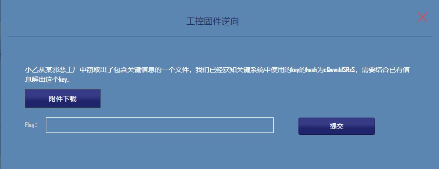
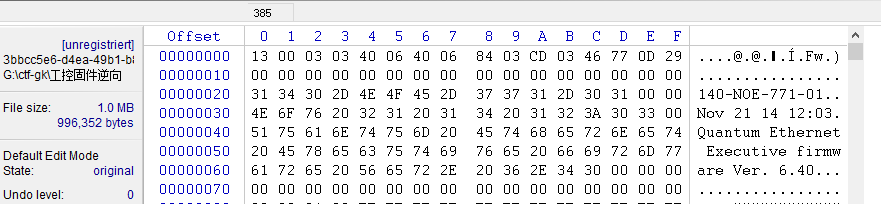
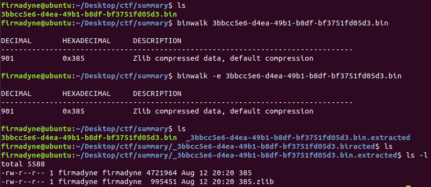
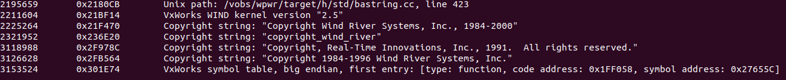
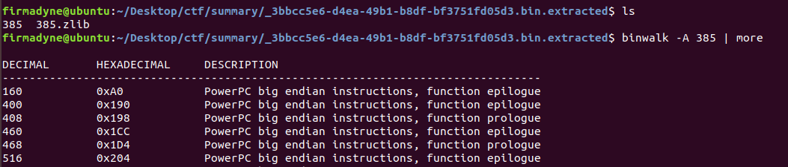
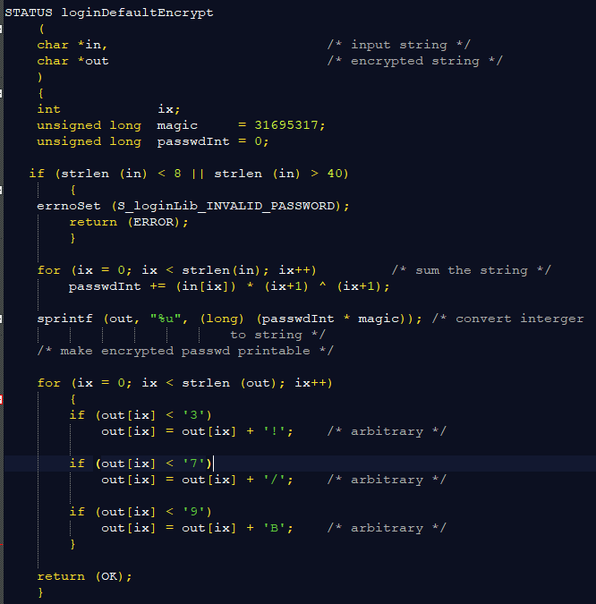
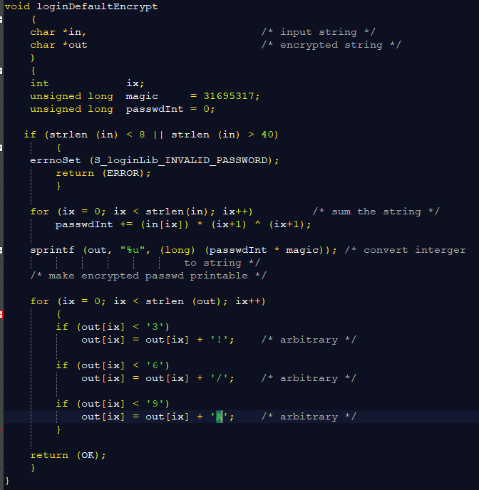
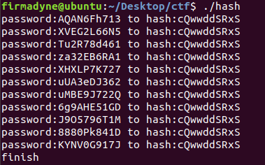

# CTF 工控固件逆向 复现writeup

题目：



解题思路：

1. winhex 查看 二进制文件

   

   

   昆腾固件 存在已公布的漏洞

2. binwalk 分析二进制文件

   

   

   

3. ida分析 打开-PPC 加载偏移地址10000

   

4. python脚本恢复函数名

   ```python
   from idaapi import *
   import time
   
   loadaddress = 0x10000
   eaStart = 0x301e64 + loadaddress
   eaEnd = 0x3293a4 + loadaddress
   
   ea = eaStart
   eaEnd = eaEnd
   while ea < eaEnd:
   	offset = 0
   	MakeStr(Dword(ea - offset),BADADDR)
   	sName = GetString(Dword(ea - offset), -1, ASCSTR_C)
   	print sName
   	if sName:
   		eaFunc = Dword(ea - offset + 4)
   		MakeName(eaFunc, sName)
   		MakeCode(eaFunc)
   		MakeFunction(eaFunc,BADADDR)
   	ea = ea+16
   ```

    函数名恢复成功

5. vxworks 源码分析

   

   重点关注 loginDefaultEncrypt函数源码，对比ida，找出差异点 (参数变了，3，6，9，A)

    ida 逆向看流程图能看到

6. ida恢复函数名以后重点关注  loginDefaultEncrypt 汇编流程图 发现 加密用的hash算法中的参数变了，根据源码可重新编写函数

   

7. 这个题的目标是找到hash碰撞 所以在linux环境下，编写shell脚本  创建 10位字母数字组合的密码本 1.txt

   ```bash
   #!/bin/bash
   a=(a b c d e f g h i g k l m n o p q r s t u v w x y z \
      A B C D E F G H I J K L M N O P Q R S T U V W X Y Z \
      0 1 2 3 4 5 6 7 8 9)
   
   for ((j=0;j<1000000;j++));do
   for ((i=0;i<10;i++));do
   
   	echo -n ${a[$RANDOM % ${#a[@]}]}
   done
   	echo -e "\r"
   done
   
   echo
   ```

8. 编写代码 guesshash， hash碰撞成功

    给每个密码hash值并和给定的值比较，一致就认为碰撞出来了

   ```c
   #include<stdio.h>
   #include<string.h>
   
   void loginDefaultEncrypt(char *in, char *out);
       
   int main()
   {
   	char inC[255];
   	char outC[255];
   
   	FILE *fp = fopen("1.txt","r");
   	if(NULL == fp)
   	{
   		printf("failed to open dos.txt");
   		return 1;
   	}
   
   	while(!feof(fp))   //while read row
   	{
   		memset(inC, 0, 255);
   			memset(outC, 0 ,255);
   		fgets(inC, sizeof(inC) - 1, fp);
   			if(strlen(inC) < 8)
   				continue;
   			int len = strlen(inC);
   			len = len-2;
   			inC[len] = 0;
   			loginDefaultEncrypt(inC,outC);
   			if(strcmp(outC, "cQwwddSRxS")==0)
   			{
   				printf("password:%s to hash:%s\n",inC,outC);
   			}
   	}
   	fclose(fp);
   	printf("finish\n");
   	return 0;
   }
   
   void loginDefaultEncrypt
       (
       char *in,                           /* input string */
       char *out                           /* encrypted string */
       )
       {
       int            ix;
       unsigned long  magic     = 31695317;
       unsigned long  passwdInt = 0;
   
      if (strlen (in) < 8 || strlen (in) > 40)
           {
   	//errnoSet (S_loginLib_INVALID_PASSWORD);
           //return (ERROR);
   	printf("password is not long enough\n");
           }
   
       for (ix = 0; ix < strlen(in); ix++)         /* sum the string */
           passwdInt += (in[ix]) * (ix+1) ^ (ix+1);
   
       sprintf (out, "%u", (long) (passwdInt * magic)); /* convert interger
   							to string */
       /* make encrypted passwd printable */
   
       for (ix = 0; ix < strlen (out); ix++)
           {
           if (out[ix] < '3')
               out[ix] = out[ix] + '!';    /* arbitrary */
   
           if (out[ix] < '6')
               out[ix] = out[ix] + '/';    /* arbitrary */
   
           if (out[ix] < '9')
               out[ix] = out[ix] + 'A';    /* arbitrary */
           }
   
       return ;
    }
   ```

   

总结：

1. 漏洞点：vxworks源码存在漏洞-hash碰撞
2. binwalk用法
3. idapython用法 （mmp，老子安了一下午idapython, 绿色版不行，最后找的 安装版 文件夹直接拷过来的，script-file就能直接导入python脚本了）

参考资料：

https://www.freebuf.com/vuls/177036.html

https://paper.seebug.org/771/