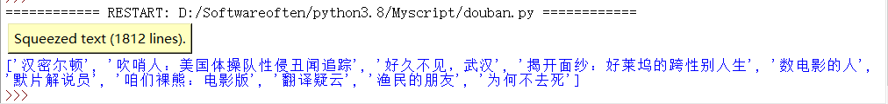
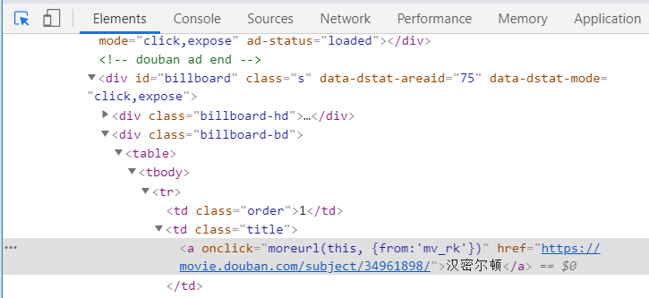
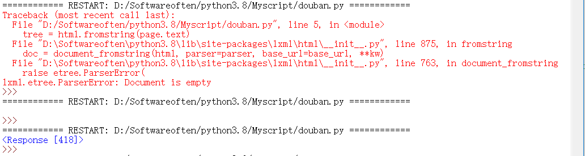

# 5分钟-8行代码-写爬虫

tags: 爬虫

date: 2020-07-16

（emm, 大神5分钟，小白1小时)

## 目标

爬取豆瓣电影-一周口碑排行榜

## 代码

```python
import requests
from lxml import html

url = 'https://movie.douban.com/'
headers = {'Referer':'https://movie.douban.com/','User-Agent':'Mozilla/5.0 (Windows NT 10.0; xxx) AppleWebKit/537.36 (KHTML, like Gecko) Chrome/xxx Safari/537.36'}
#headers要根据自己的浏览器来配置

page = requests.get(url, headers=headers)
tree = html.fromstring(page.text)
result = tree.xpath('//td[@class="title"]//a/text()')

#print(page.text)
print(result)

```

## 结果



爬到了豆瓣电影页面“一周口碑榜”


---

## 环境配置

Windows + python3.8

刚开始有一些需要导入的库，如果以前没有下载过，要先打开cmd下载

```python
pip install requests
pip install lxml
```

## 原理+步骤

爬虫要点：

1. 爬虫的网址  （douban.movie）

2. 需要爬取的内容和数据  

   ```python
   result = tree.xpath('//td[@class="title"]//a/text()')
   ```

   这行也是关键的爬取代码

#### 如何找到这部分？

1. 打开需要爬取的网页，按 F12，打开开发者工具

2. 点左上角小箭头，此时鼠标选中网页各个模块（右键-检查），调试代码会自动跳转到相应的地方，找到要爬的部分  

   

   看到这一行，和关键代码有很多相似的地方。原理如下：

   '//td[@class="title"]//a/text()'

   1）//td	: 相当于指定大目录

   2）[@class="title"]  : 指定小目录

   3）//a	: 最小的目录

   4）/text()   :  提取的数据

   （就是按照网页的结构，一层层找到需要的爬取的数据所在的路径）

## 报错+调试

最开始，由于代码缺少headers行，导致如下报错：



调试过程，注释掉result行，print(page.text) ，response 418 —— 说明请求出错

后来发现需要添加 headers

#### 如何找到 headers

1. F12开发者工具，Network-显示的request里随便点开一个
2. 就会显示Headers，往下拉，找到User-Agent
3. 把User-Agent 的内容copy到headers里

再运行，request 200，成功啦！

---

### 补充小知识点：http 状态码

1xx - 表示临时响应并需要请求者继续执行操作的状态代码 

2xx - 请求成功  (200 -  表示成功处理了请求，一般情况下都是返回此状态码)

3xx - 重定向代码 

4xx - 请求出错

5xx - 不常见，但也表示请求失败

详情参见 https://www.cnblogs.com/cjwxf/p/6186287.html 

（唔，有关 418 据说是个彩蛋： I am a teapot）

---

想学习爬虫可以了解：xpath /  scarpy

### 致谢：

hhh在本文最后要十分感谢我**聪明可爱又温柔有耐心的大佬姐姐**

啊，感恩的心，感恩姐姐深夜远程指导，共同学习，共同进步~

## 参考文献

原实验： https://blog.csdn.net/csqazwsxedc/article/details/68498842 

解决报错：https://blog.csdn.net/weixin_43144769/article/details/105715728?utm_medium=distribute.wap_relevant.none-task-blog-BlogCommendFromMachineLearnPai2-1.nonecase&depth_1-utm_source=distribute.wap_relevant.none-task-blog-BlogCommendFromMachineLearnPai2-1.nonecase