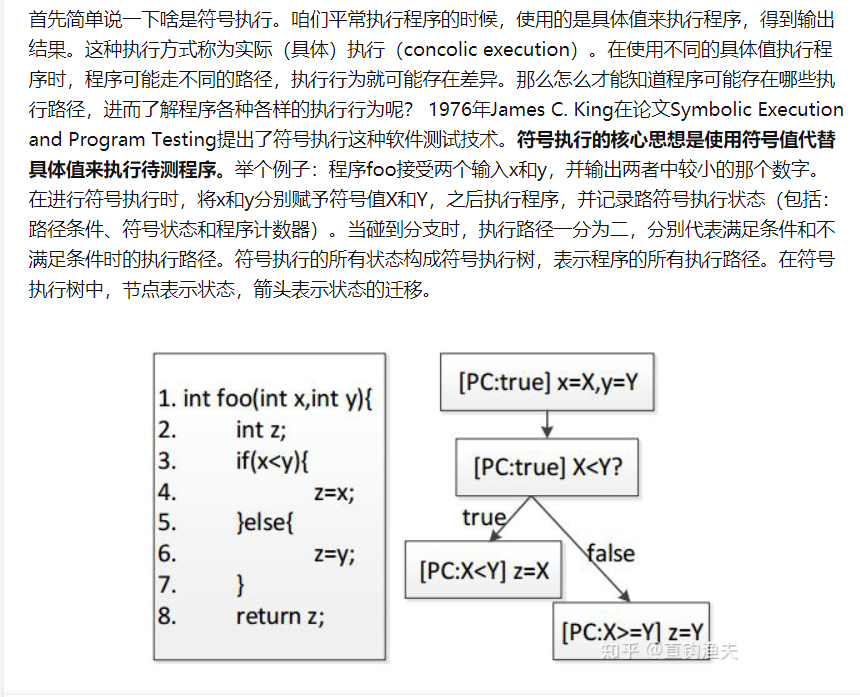
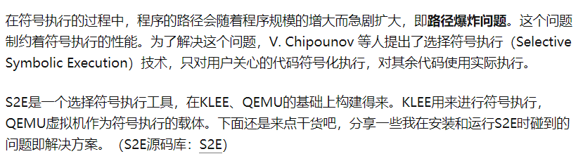

# 物联网漏洞挖掘 & 物联网中无文件型恶意软件检测

## 全系统仿真

### Firmadyne

FirmAE

### HALucinator

### P2IM

### Pretender

## 混合仿真

### Avatar

### Avatar2

## 漏洞挖掘

IoTFuzzer

FirmAFL?

FirmFuzz?

S2E

angr

KLEE

 SYMQEMU ？？

无文件恶意文件

​	 无文件恶意软件也是需要使用文件的，只是平常的它们都处于隐身状态。最初的无文件恶意软件指的就是那些不使用本地持久化技术或者说完全驻留在内存之中的恶意代码，但后期演变后到现在，通常会将那些传统防毒软件无法识别的，依赖于文件系统的某些功能来实现恶意代码激活和驻留的恶意软件也当做是无文件恶意软件。 

---

----

方向：物联网固件仿- 以firmadyne工作为基础，采用模板赋值的方法，稍微提高一下固件仿真和网络可连接率

优点：老师带着，qemu那块代码已有基础，只缺自动化赋值这部分的代码

缺点：主观（不喜欢，不会做，好难，好麻烦），客观（没有后边继续做的潜在学术价值，因为已经有提升率很高的相关工作可以以他为基础直接上手了，我们只是偏工程性的解决一个仿真率低的问题，而且提升的并不太高，单出成果也就是个c，除非能和老师之前的那篇结合起来，老师说可能能投个b的期刊，但是投期刊本来就审稿时间长-半年，再加上修改，至少也得再要一年才能出成果）

预计多久出成果：目前只是写C的话，不好说，写代码，做实验，写论文-快的话7.8月，慢的话，年底，也可能出不来就不知道啥时候

方向：物联网安全

优点：未来前景好，有可持续性，如果出成果能出一个比较好的，跳过仿真这个层次，可以用已有的仿真率较高的工具，关注（应用级别或者协议层次）我看那些文章都是一个框架分两个部分，一个负责仿真，一个负责模糊测试，跑一通发现几个漏洞点验证可利用就发论文了，不知道怎么拼凑一下我也能整一个（我就是在想peach）

缺点：难，不知道什么程度的难，好底层，二进制，逆向汇编之类的，总归就是难，没人帮我

预计多久出成果：看论文1个月，找可做的点，半年，研究，写论文，投，保守估计也得一年

其实安全按理来说就是仿真之后的下一个点，现在就是跳过了仿真，想研究物联网整个通信过程中哪里有可做的点

做自己喜欢的也是要有代价的呀，没有别人的脑子，还想吃大饼，小心两头皆空

不过努力的话，也不是非要A，应该出个c也不是那么难吧，我不如O，难道还不如KD吗？？？

---

## 补充知识

### 符号执行和S2E

### 原子操作

 所谓原子操作是指不会被[线程调度](https://baike.baidu.com/item/线程调度/10226112)机制打断的操作；这种操作一旦开始，就一直运行到结束，中间不会有任何 context switch  

原子操作可以是一个步骤，也可以是多个操作步骤，但是其顺序不可以被打乱，也不可以被切割而只执行其中的一部分。

将整个操作视作一个整体是原子性的核心特征。

